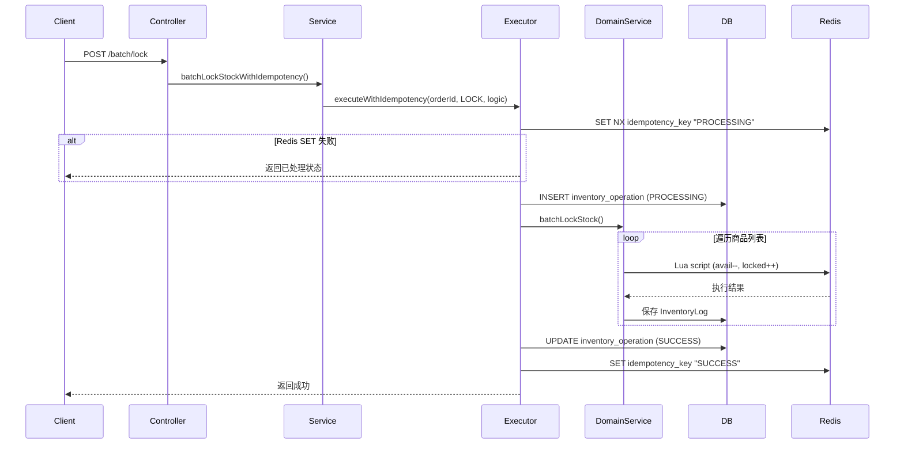
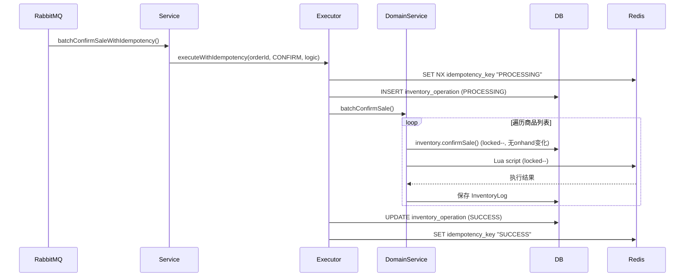
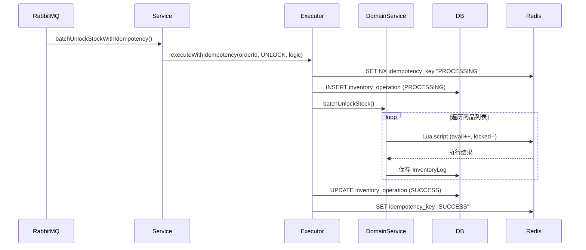

# Inventory Service 架构与功能文档

## 1. 项目概述

### 1.1 项目简介
Inventory Service 是电商平台微服务架构中的库存服务，负责管理商品库存的扣减、锁定、确认和解锁操作。该服务采用了乐观锁、Redis缓存、幂等性控制和分布式锁等高级并发控制技术，确保在高并发场景下库存数据的准确性和一致性。

### 1.2 技术栈
- **框架**: Spring Boot 3.2.5
- **数据库**: MySQL 8.0.32
- **ORM**: Spring Data JPA + Hibernate
- **缓存**: Redis (Lua脚本)
- **消息队列**: RabbitMQ (集成测试)
- **测试**: JUnit 5, Testcontainers, MockMvc
- **构建**: Maven

## 2. 核心架构设计

### 2.1 分层架构
```
┌─────────────────────────────────────────────────────────────┐
│                    Controller Layer                         │
│  - InventoryController (API接口)                            │
│  - AdminInventoryController (管理后台)                      │
└────────────────────┬────────────────────────────────────────┘
                     │
┌────────────────────▼────────────────────────────────────────┐
│                    Service Layer                            │
│  - InventoryService (业务服务接口)                          │
│  - InventoryServiceImpl (业务服务实现)                      │
│  - InventoryDomainService (领域服务接口)                    │
│  - InventoryDomainServiceImpl (领域服务实现)                │
│  - InventoryIdempotencyExecutor (幂等执行器)                │
└────────────────────┬────────────────────────────────────────┘
                     │
┌────────────────────▼────────────────────────────────────────┐
│                  Repository Layer                           │
│  - InventoryRepository                                      │
│  - InventoryOperationRepository                             │
│  - InventoryLogRepository                                   │
└────────────────────┬────────────────────────────────────────┘
                     │
┌────────────────────▼────────────────────────────────────────┐
│                   Domain Layer                              │
│  - Inventory (库存实体)                                     │
│  - InventoryOperation (幂等操作记录)                        │
│  - InventoryLog (库存日志)                                  │
│  - OperationType (操作类型枚举)                             │
│  - OperationStatus (操作状态枚举)                           │
└─────────────────────────────────────────────────────────────┘
```

### 2.2 数据模型

#### 2.2.1 Inventory (库存实体)
```java
@Entity
@Table(name = "inventory")
public class Inventory {
    @Id
    @GeneratedValue(strategy = GenerationType.IDENTITY)
    private Long id;
    
    @NotNull
    private Long productCode;
    
    private Integer availableStock;  // 可用库存
    private Integer lockedStock;     // 锁定库存
    
    @Version
    private Long version;  // 乐观锁版本号
}
```

**核心方法**:
- `lock(Integer quantity)`: 锁定库存 (availableStock -= quantity, lockedStock += quantity)
- `unlock(Integer quantity)`: 解锁库存 (availableStock += quantity, lockedStock -= quantity)
- `confirmSale(Integer quantity)`: 确认销售 (lockedStock -= quantity)
- `deductStock(Integer quantity)`: 直接扣减库存
- `increaseStock(Integer quantity)`: 增加库存

#### 2.2.2 InventoryOperation (幂等操作记录)
```java
@Entity
@Table(name = "inventory_operation")
public class InventoryOperation {
    @Id
    @GeneratedValue(strategy = GenerationType.IDENTITY)
    private Long id;
    
    private Long orderId;
    private OperationType operationType;
    private OperationStatus operationStatus;
    private LocalDateTime createdAt;
    private LocalDateTime updatedAt;
}
```

**作用**: 记录每个订单的库存操作状态，实现幂等性控制

#### 2.2.3 InventoryLog (库存日志)
```java
@Entity
@Table(name = "inventory_log")
public class InventoryLog {
    @Id
    @GeneratedValue(strategy = GenerationType.IDENTITY)
    private Long id;
    
    @NotNull
    private Long productCode;
    private Integer quantity;
    private String orderId;
    private OperationType operationType;
    private LocalDateTime createdAt;
}
```

**作用**: 记录所有库存变动历史，用于审计和追溯

## 3. 核心业务流程

### 3.1 库存锁定流程 (batchLockStock)



**关键特性**:
1. **Redis Lua脚本原子操作**: 确保库存扣减的原子性
2. **数据库乐观锁**: @Version 字段防止并发更新冲突
3. **幂等性控制**: 通过 orderId + operationType 唯一键实现
4. **异常回滚**: 部分失败时回滚已成功的Redis操作

### 3.2 库存确认流程 (batchConfirmSale)



**业务含义**: 订单支付成功后，将锁定的库存确认为已售出

### 3.3 库存解锁流程 (batchUnlockStock)



**业务含义**: 订单取消或超时未支付时，释放锁定的库存

## 4. 并发控制机制

### 4.1 乐观锁 (Optimistic Locking)

**实现方式**:
```java
@Version
private Long version;
```

**工作原理**:
1. 读取数据时获取 version 值
2. 更新时 WHERE 条件包含 version
3. 如果 version 不匹配，抛出 OptimisticLockingFailureException
4. 应用层捕获异常并重试

**重试机制**:
- `InventoryIdempotencyExecutor` 专门处理 OptimisticLockingFailureException
- 删除幂等记录和 Redis key，允许重试
- 与其他异常（如库存不足）区分处理

### 4.2 Redis 分布式锁

**Lua 脚本**:
```lua
-- lock.lua: 锁定库存
local available = redis.call('get', KEYS[1])
if not available or tonumber(available) < tonumber(ARGV[1]) then
    return 0
end
redis.call('decrby', KEYS[1], ARGV[1])
redis.call('incrby', KEYS[2], ARGV[1])
return 1

-- unlock.lua: 解锁库存
local locked = redis.call('get', KEYS[2])
if not locked or tonumber(locked) < tonumber(ARGV[1]) then
    return 0
end
redis.call('incrby', KEYS[1], ARGV[1])
redis.call('decrby', KEYS[2], ARGV[1])
return 1

-- confirm.lua: 确认销售
local locked = redis.call('get', KEYS[1])
if not locked or tonumber(locked) < tonumber(ARGV[1]) then
    return 0
end
redis.call('decrby', KEYS[1], ARGV[1])
return 1
```

**优势**:
- 原子性：Lua 脚本在 Redis 中单线程执行
- 高性能：避免网络往返
- 一致性：确保多个键的原子操作

### 4.3 幂等性控制

**核心类**: `InventoryIdempotencyExecutor`

**执行流程**:
1. Redis SET NX 获取执行权
2. 如果失败，检查状态：
    - SUCCESS → 返回成功（不执行业务）
    - FAILED → 抛出异常
    - PROCESSING → 抛出异常
3. 如果成功，INSERT 幂等记录 (PROCESSING)
4. 执行业务逻辑
5. 更新幂等记录为 SUCCESS
6. 更新 Redis 状态为 SUCCESS

**异常处理**:
- `OptimisticLockingFailureException`: deleteOperation + 删除 Redis key（允许重试）
- 其他异常: markFailed（不允许重试）

## 5. API 接口设计

### 5.1 库存锁定接口
```
POST /inventories/batch/lock
Content-Type: application/json

{
  "orderId": 1001,
  "stockRequestList": [
    {"productCode": 2001, "quantity": 10},
    {"productCode": 2002, "quantity": 5}
  ]
}
```

### 5.2 库存确认接口
```
POST /inventories/batch/confirm
Content-Type: application/json

{
  "orderId": 1001,
  "stockRequestList": [
    {"productCode": 2001, "quantity": 10}
  ]
}
```

### 5.3 库存解锁接口
```
POST /inventories/batch/unlock
Content-Type: application/json

{
  "orderId": 1001,
  "stockRequestList": [
    {"productCode": 2001, "quantity": 10}
  ]
}
```

### 5.4 管理后台接口
```
POST /admin/inventories/deduct  // 直接扣减库存
POST /admin/inventories/add     // 直接增加库存
POST /admin/inventories/create  // 创建库存记录
```

## 6. 测试策略

### 6.1 单元测试
- `InventoryCoreFlowTest`: 核心流程测试
- `InventoryConcurrencyTests`: 并发测试

### 6.2 集成测试
- `InventoryApiTests`: API 接口测试
- `InventoryOptimisticLockRetryTest`: 乐观锁重试测试（10个场景）
- `InventoryOptimisticLockDeterministicTest`: 确定性乐观锁测试
- `InventoryMQIntegrationTest`: MQ 集成测试
- `InventoryLogApiTests`: 库存日志测试

### 6.3 测试场景覆盖
1. **乐观锁冲突处理**: 验证 deleteOperation vs markFailed
2. **幂等性控制**: 重复请求不重复执行业务
3. **并发安全**: 多线程并发锁定同一商品
4. **异常处理**: 库存不足、商品不存在等
5. **状态一致性**: Redis 与 DB 状态最终一致

## 7. 关键设计决策

### 7.1 为什么使用乐观锁而不是悲观锁？
- **高并发场景**: 读多写少，乐观锁性能更好
- **冲突概率低**: 库存操作冲突概率相对较低
- **避免死锁**: 乐观锁不会产生死锁

### 7.2 为什么使用 Redis Lua 脚本？
- **原子性**: 确保多个操作的原子性
- **性能**: 减少网络往返
- **一致性**: 避免中间状态

### 7.3 为什么区分 OptimisticLockingFailureException 和其他异常？
- **OptimisticLockingFailureException**: 临时性异常，可重试
- **其他异常**: 业务异常，不应重试（如库存不足）

### 7.4 为什么需要 InventoryLog？
- **审计追溯**: 记录所有库存变动
- **问题排查**: 便于定位问题
- **数据修复**: 支持数据修复和补偿

## 8. 部署与运维

### 8.1 依赖服务
- MySQL 数据库
- Redis 缓存
- RabbitMQ 消息队列（可选，用于异步解耦）

### 8.2 监控指标
- 库存操作成功率
- 乐观锁冲突率
- Redis 命中率
- API 响应时间

### 8.3 告警策略
- 库存操作失败率 > 5%
- 乐观锁冲突率 > 10%
- Redis 连接失败
- API 响应时间 > 1s

## 9. 未来优化方向

### 9.1 性能优化
- 批量操作优化
- Redis 集群分片
- 数据库读写分离

### 9.2 功能增强
- 库存预占机制
- 库存预警
- 库存调拨

### 9.3 可观测性
- 分布式链路追踪
- 详细日志记录
- 业务指标监控

## 10. 参考资料

### 10.1 相关文档
- `IDEMPOTENCY_DESIGN.md`: 幂等性设计文档
- `IDEMPOTENCY_FIX_ANALYSIS.md`: 幂等性修复分析
- `redisTechPlan.md`: Redis 技术方案

### 10.2 测试文件
- `InventoryOptimisticLockRetryTest.java`: 乐观锁重试测试
- `InventoryOptimisticLockDeterministicTest.java`: 确定性乐观锁测试
- `InventoryLogApiTests.java`: 库存日志测试

---

**文档版本**: v1.0  
**最后更新**: 2026-05-14  
**维护者**: 架构团队
